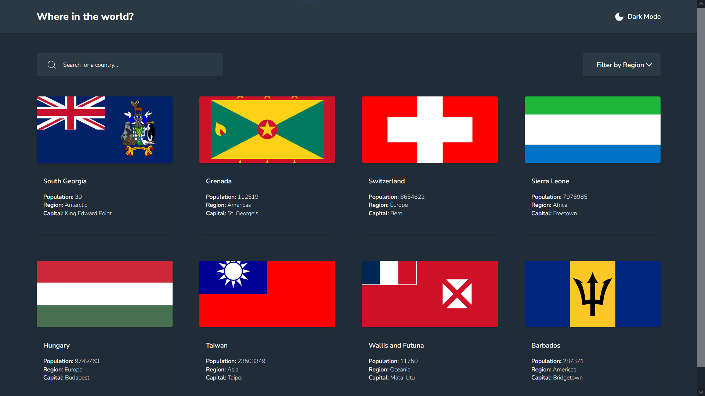

# Frontend Mentor - REST Countries API with color theme switcher solution

This is a solution to the [REST Countries API with color theme switcher challenge on Frontend Mentor](https://www.frontendmentor.io/challenges/rest-countries-api-with-color-theme-switcher-5cacc469fec04111f7b848ca). Frontend Mentor challenges help you improve your coding skills by building realistic projects.

## Table of contents

- [Overview](#overview)
  - [The challenge](#the-challenge)
  - [Screenshot](#screenshot)
  - [Links](#links)
- [My process](#my-process)
  - [Built with](#built-with)
  - [What I learned](#what-i-learned)
  - [Continued development](#continued-development)
- [Author](#author)

## Overview

### The challenge

Users should be able to:

- See all countries from the API on the homepage
- Search for a country using an `input` field
- Filter countries by region
- Click on a country to see more detailed information on a separate page
- Click through to the border countries on the detail page
- Toggle the color scheme between light and dark mode _(optional)_

### Screenshot

### Links

- Solution URL: [Github](https://github.com/medaich/rest-countries-api)
- Live Site URL: [Vercel](https://rest-countries-api-zeta-rose.vercel.app/)

## My process

### Built with

- Semantic HTML5 markup
- Flexbox
- Grid
- [Tailwind](https://tailwindcss.com/) - css utility first framework
- [React](https://reactjs.org/) - JS library
- [React Router](https://reactrouter.com/) - React library

### What I learned

I've implemented dark mode toggling using Tailwind's dark utility which helps.

I've practiced manipulating data on the client-side (search, filter) which makes it so fast rather than doing a fetch request whenever the user writes a character in search query or change filter option. However this approach also have its downsides; Like waiting untill all the countries' data is fetched on first load for rendering 8 countries despite it's not a big deal regarding it's just 249 countries with minimal properties.

### Continued development

I'd like to continue improving my React skills building more projects experimenting its powerful ecosystem using React Tanstack (React Query) for remote state, useReducer, context API, Redux and Redux Toolkit for global state, and also React Patterns such as Compound Component, HOC and render prop.

## Author

- Frontend Mentor - [@medaich](https://www.frontendmentor.io/profile/medaich)
- Twitter - [@medaichx](https://www.twitter.com/medaichx)
